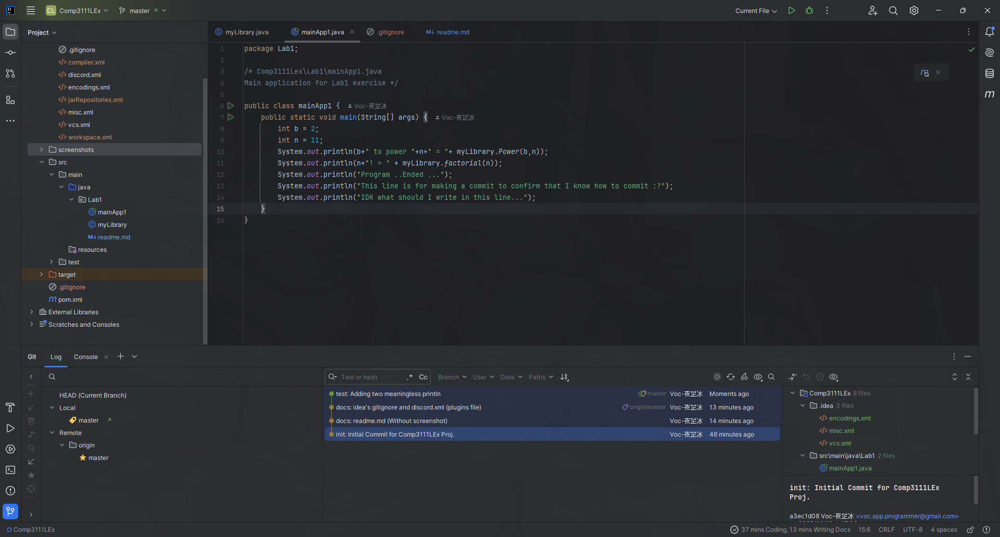

# COMP3111 Lab1

- [x] I have learnt the way to build a Java Project in Intelij;
- [x] I have successfully created my first GitHub repo for COMP3111
- [x] I know how to share project source with others via GitHub

Here's the screenshot:

